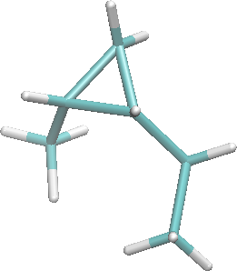

zmattools - examples
=========

This folder contains a PDB file of a methyl,ethyl-cyclopropane molecule

To create the z-matrix for this molecule use

    zmat generate model.pdb

which should produce

    C4 DM3 DM2 DM1
    C6 C4 DM3 DM2
    C5 C6 C4 DM3
    H10 C5 C4 C6
    C3 C4 C6 C5
    C2 C3 C4 C6
    H21 C2 C3 C4
    H41 C4 C6 C3
    C7 C6 C4 C5
    H73 C7 C6 C4
    H71 C7 C6 H73
    H72 C7 C6 H73
    H61 C6 C4 C5
    H31 C3 C4 C2
    H32 C3 C4 C2
    H51 C5 C4 C6
    H22 C2 C3 H21
    H23 C2 C3 H21

where `DM3`, `DM2` and `DM1`are dummy atoms.

---

To create an input for Gaussian use

    zmat generate model.pdb

which should produce the following output that can be put in a Gaussian input file

    C
    C   1 1.506
    C   2 1.504  1   60.052
    H   3 1.085  1  118.788  2 -107.290
    C   1 1.500  2  120.550  3 -109.077
    C   5 1.527  1  111.291  2  -84.063
    H   6 0.949  5  110.087  1 -178.375
    H   1 0.949  2  117.961  5 -144.046
    C   2 1.524  1  118.789  3  107.515
    H   9 0.949  2  109.494  1  179.936
    H   9 0.949  2  109.436 10  120.044
    H   9 1.091  2  109.424 10 -120.015
    H   2 0.949  1  117.767  3 -107.923
    H   5 0.949  1  108.545  6 -120.893
    H   5 0.949  1  110.648  6  122.024
    H   3 0.949  1  117.880  2  107.904
    H   6 0.949  5  109.968  7  121.396
    H   6 0.949  5  109.891  7 -121.391
